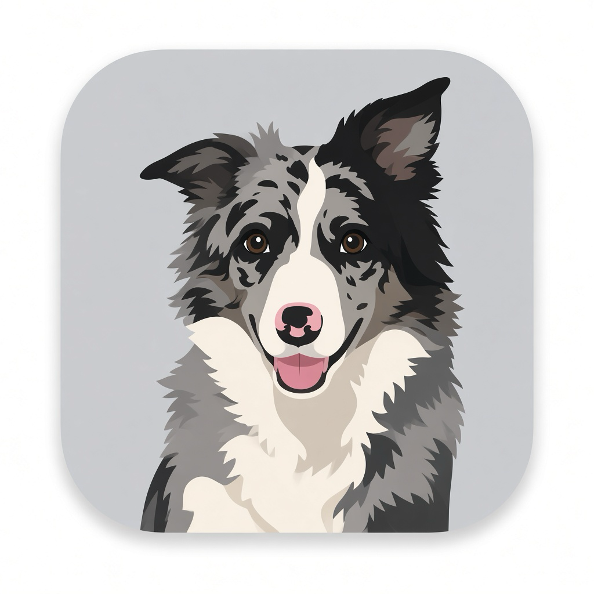

# Amora



Amora is an early macOS menu bar prototype that displays the latest activity reported by Codex, Cursor, and Claude Code. It receives local lifecycle hooks over a Unix socket and shows the activity in a small menu bar popover and on a floating desktop pet.

Amora does not yet include research features.

## Install

Download the Apple Silicon disk image from the [latest GitHub release](https://github.com/pedronvasconcelos/amora-ai/releases/latest). Open it and drag Amora into Applications.

Amora is unsigned. The first time you open it, Control-click Amora in Applications, choose **Open**, then choose **Open** again. After that, the paw icon appears in the menu bar.

The packaged app needs macOS 14 or later on Apple Silicon. It does not need Swift or Xcode.

Click the paw icon to see the latest activity. Choose **Pets…** to open the Pets window, where you add pets to the desktop (up to six), pick each pet's model, show or hide it, make it active, or remove it. Each pet keeps its own model and position on this Mac. Choose **Settings…** to open the Settings window. Quit Amora from that menu.

### Pet models

Amora accepts pet models in the same format as Codex custom pets: a folder with a `pet.json` manifest and a transparent `spritesheet.webp` (or PNG). In the Pets window, choose **Register model…**, then drag `pet.json` and the spritesheet, or the folder that contains them, onto the drop zone. Amora validates the package, shows a preview of each animation, and copies it to `~/Library/Application Support/Amora/pets/<id>/`. Registering a model with an existing `id` replaces it.

```json
{
  "id": "codie",
  "displayName": "Codie",
  "description": "A tiny robot companion.",
  "spritesheetPath": "spritesheet.webp"
}
```

The spritesheet has 8 columns of 192×208 cells: 1536×1872 with 9 rows for version 1, or 1536×2288 with 11 rows when `pet.json` declares `"spriteVersionNumber": 2`. Rows follow the Codex order: `idle`, `running-right`, `running-left`, `waving`, `jumping`, `failed`, `waiting`, `running`, `review`. Each row plays its consecutive non-empty frames from the first column. Amora shows `idle` while resting, `review` while thinking, `running` while working, `waiting` while waiting, and `jumping` when finished.

Settings lists Codex, Cursor, and Claude Code. Each row shows **Installed** or **Not installed**, with **Install** or **Remove**. **Launch at login** is under General. The choice is saved on this Mac. macOS opens Amora at login when Amora is in Applications; `swift run` only stores the preference.

Installing hooks keeps your existing settings and any hooks you or another tool already configured. Each hook sends only a fixed activity value to Amora; it does not forward prompts, files, or tool input and output. If Amora is not running, the hook exits without interrupting the agent.

To enable Codex activity, choose **Install** next to Codex, then review and trust Amora's hooks in Codex settings or with `/hooks` in the Codex CLI.

To enable Cursor activity, choose **Install** next to Cursor, then review and trust Amora's hooks in Cursor Hooks settings.

To enable Claude Code activity, choose **Install** next to Claude Code, then review and trust Amora's hooks in Claude Code settings.

## Run from source

```sh
git clone https://github.com/pedronvasconcelos/amora-ai.git
cd amora-ai
swift run Amora
```

`swift run` stays open while the menu bar app is running. Quit Amora from the menu or press `Ctrl+C` in the Terminal.

Requires Swift 6.2 or later.

## Test

```sh
swift test
```

## Package

```sh
sh scripts/package.sh
```

Writes `dist/Amora.app` and `dist/Amora-<version>-arm64.dmg`. Push a `v*` tag to publish a GitHub Release.

## Project status

This is an early, work-in-progress prototype. You can install the macOS app, open Settings, connect Codex, Cursor, and Claude Code activity, and watch that activity on desktop pets. Contributions and focused bug reports are welcome.

## License

Amora is available under the [MIT License](LICENSE).
